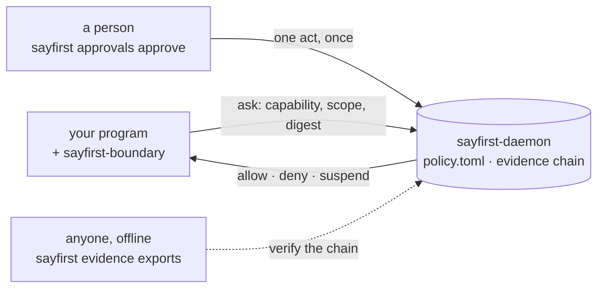

<!-- SPDX-License-Identifier: Apache-2.0 -->
# `sayfirst` control plane

**SayFirst — ask before you act.** This repository is the engine room: the
daemon that answers, the contract it answers over, the boundary a governed
program calls, the policy format a person reads, and the evidence chain anyone
can check afterwards.

## The 30-second tour

A governed program puts one question to a local control plane before it does
anything that matters: *may I do this, with these arguments, as this account?*

- The daemon answers one of **three** things — **allow**, **deny**, **suspend**
  — from a policy file a person can read.
- It listens on a Unix socket and nowhere else, and it learns who is asking
  from the kernel's own peer credentials. No token, no port, nothing to leak.
- A suspension is a wait for a person. One command ends it, once; the same
  question asked again is allowed — or denied with the reason the person gave.
- Every decision lands in a hash-chained record that a third party can read
  back and check offline, with the contract distribution alone, no daemon.
- "Could not ask" is an answer of its own, never written as denied and never
  as allowed.



## Three lines worth repeating

**The program never decides.** It asks, and it does only what was allowed. The
boundary holds the answer as a grant for exactly the question it answers, and
stops honouring it the moment any of four things happens: the connection
carrying it ends, its lifetime runs out, the policy version it was issued under
changes, or the control plane goes silent for a lifetime.

**A person is in the loop by construction, not by dashboard.** An approval is
one person's act, taken once; the deadline is the policy's own
`review_deadline_seconds`, not the tool's; the allow it produces is the one
execution that act authorised, and a rejection is final — the next ask of that
question is a deny that says why.

**The evidence is honest about itself.** The two paragraphs below are the
product's spine, not a footnote — read them before anything else on this page.

## The grade, said plainly

A deployment of this version is graded **observability** — the governed program
can write or replace the evidence store, so the record it keeps is one that
program could have forged — or **unverified**, which claims nothing, and which
is also the answer where the program *cannot* write the store, exclusivity
being a separate thing to prove. At neither grade is any claim of proof or of
tamper detection made.

Article 7 of the constitution defines a third grade, **evidence**, and no
deployment of this version reaches it. It will require the daemon under its own
user id, no principal but that one and root able to write or replace the store
on any mutation path the store adapter knows, and a store adapter that can
prove that exclusivity. It is a rule this project holds itself to, not a
capability shipped here — which is why the grade this version reports is the
conservative one. [`SECURITY.md`](SECURITY.md) states all three.

## Install

```console
$ uvx --from sayfirst-cli==0.2.0 sayfirst --help
usage: sayfirst [-h]
                {ask,trace,explain,evidence,approvals,instrument,packs} ...
```

Seven verbs; `uv tool install sayfirst-cli==0.2.0` keeps them on your path.
On the index today: `sayfirst-cli`, `sayfirst-contract`, `sayfirst-boundary`,
`sayfirst-contract-stub`, `sayfirst-conformance`. The daemon
(`sayfirst-control-plane`), its operator surface (`sayfirstd`) and the port
conformance kit (`sayfirst-testing`) are **publishing**; until they land, run
them from a checkout of this repository:
`uv sync --frozen --all-packages && uv run --frozen sayfirst-daemon --help`.

## Try it in five minutes

The client's
[`QUICKSTART.md`](https://github.com/fredaime/sayfirst-cli/blob/main/QUICKSTART.md)
installs the command beside its daemon and walks one governed decision end to
end. Every command on it was run, in that order, before it was written down,
and the answers are pasted from that run. The lines it exists for:

```console
$ .venv/bin/sayfirst ask --capability example.send --scope local --socket $S
outcome: suspend
reason: policy_requires_review
$ .venv/bin/sayfirst approvals approve --approval $A --scope local --socket $S --reason "checked by hand"
state: approved
$ .venv/bin/sayfirst ask --capability example.send --scope local --socket $S
outcome: allow
reason: approval_granted
```

Nothing executed before the person acted; that second allow is the one
execution their act authorised.

## What you get

The daemon and the boundary are here; the verbs below are the client's, and the
client is a repository of its own (see Architecture).

- **Three outcomes, closed** (article 1), with exit codes a shell can branch on:
  `0` allow, `1` deny, `5` suspend, `3` refused, `4` could not ask.
- **A person's approval with a deadline** — `approvals show`, `approvals
  approve`, `approvals reject`. The deadline comes from the policy file.
- **Evidence you can read and hand over** — `trace` follows one decision into
  the chain, `explain` gives the daemon's own reason and policy version,
  `evidence export` writes a bundle, and `evidence exports DIRECTORY` re-checks
  a directory of them with the contract distribution alone.
- **Instrumentation for programs whose effects are library calls** —
  `instrument run` puts the boundary in front of a program, and
  `instrument verify` proves, from the interpreter's own audit hook and the
  chain alone, that every named effect was decided first. `packs list` prints
  the three that name them: `database`, `http-client`, `subprocess`.
- **The boundary by hand for programs that are not** — `sayfirst-boundary` is
  an in-process object you wrap an effect in. It publishes no exit codes;
  outcomes leave as exceptions.
- **Two deployment modes** — per-user (one account, socket `0700`) and system
  (several accounts admitted by a group, socket `0660` owned by root);
  `docs/deployment.md` has the forms, the revocation latency and what a peer
  credential means per platform.
- **A conformance replay and an operator surface** — `sayfirst-conformance`
  replays the published scenarios against a real server, and `sayfirstd status`
  names the caller's grade, its basis and the active privacy provider.

## What it is not, yet

- **Not a sandbox.** A governed program *calls* the boundary; a program that
  does not call it is not governed, and nothing here stops it. Pair this with
  operating-system sandboxing for code you do not trust (article 2).
- **No proof, no tamper detection.** The hash chain catches accidental
  corruption and incomplete tampering; a program that can replace the store can
  rewrite the chain whole and nothing would notice. See the grade above.
- **Honest verdicts rather than flattering ones.** A bundle taken while the
  daemon's epoch is open reports `coverage: unknown` and exits `7` — « could
  not check », not « broken ». A decision a person granted re-derives as
  `unverifiable`, cause `reason_outside_recipe`: a policy file cannot
  re-derive a human act.
- **No fleet, no tenancy, no console.** Article 1 keeps them out on purpose:
  they belong to products built on top, which depend on this, never the reverse.
- **Two rules held by review rather than by code** — a store adapter's proof of
  exclusivity, and re-evaluating a grade *at* the documented interval instead
  of when an idle connection next asks. Article 7's own Guard says so, and
  `docs/exceptions.md` holds no entry relaxing it: both rules stay binding.
- **One number is « not reported »** for this release, never zero: article 18
  measures it beyond the boundary, where nothing here can check it
  (`docs/NEUTRALITY.md`).

## Architecture

| Repository | What it is | Distributions |
|---|---|---|
| [`sayfirst-control-plane`](https://github.com/fredaime/sayfirst-control-plane) | this one: the daemon, the contract, the boundary, the policy format, the evidence chain | seven, below |
| [`sayfirst-cli`](https://github.com/fredaime/sayfirst-cli) | the `sayfirst` command: ask, trace, explain, evidence, approvals, instrument, packs | `sayfirst-cli` |
| [`sayfirst-governed-agent-demo`](https://github.com/fredaime/sayfirst-governed-agent-demo) | an agent governed end to end, four capabilities and four answers set in one policy file — the demonstrator, not a product | none; cloned and run |

Inside this repository:

- **`packages/contract`** — generation 1 of the transport-neutral domain
  contract and its generated HTTP-over-Unix-socket binding, no runtime
  dependencies. It carries the offline verifier, which is why a third party
  needs nothing else.
- **`packages/control-plane`** — the host-scoped server core: `domain`,
  `ports`, `application`, `adapters` and `plugins`, wired together in exactly
  one place. The direction of dependency runs inward.
- **`packages/boundary`** — the in-process boundary and the grant. It holds no
  policy and decides nothing.
- **`packages/cli`** — `sayfirstd`, the operator surface: `plugins`, `whoami`,
  `status`, `conformance`. It inspects; it starts nothing.
- **`packages/conformance`**, **`packages/contract-stub`**, **`packages/testing`**
  — the replay that proves a server, the scriptable fake that decides nothing,
  and the port suites an adapter passes to be a provider.

## Guards, the gate and contributing

Every claim above is checked by something in this tree. The whole of it:

```console
$ uv run --frozen --all-packages pytest
$ uv run ruff check .
$ uv run ruff format --check .
```

`.github/workflows/ci.yml` runs that in four legs: the suite with the format
pair, the identity guards on Linux and on macOS, system mode as root in a
container, and the constitution's Guard column on its own — because the guard
that keeps that column honest has to run on a day the workspace cannot be
installed, which is the day it drifted. Repository-scope guards read the tree
rather than trust it: public vocabulary, published pointers, licence headers,
the decided name, and `tests/test_grade_claims.py`, which fails if this page
ever offers a grade this version cannot obtain. Sign off every commit
(`git commit -s`); the Developer Certificate of Origin check runs on each one.

- Governance and how decisions are made: [`GOVERNANCE.md`](GOVERNANCE.md)
- What this software does and does not protect against: [`SECURITY.md`](SECURITY.md)
- Contributing, the DCO and the corporate CLA: [`CONTRIBUTING.md`](CONTRIBUTING.md)
- Names and marks: [`TRADEMARKS.md`](TRADEMARKS.md)
- Licence: [`LICENSE`](LICENSE) (Apache-2.0) and [`NOTICE`](NOTICE)

## Status

**0.2.0 is the first public release**; [`CHANGELOG.md`](CHANGELOG.md) says what
it carries. This repository was born empty on 2026-09-01 under the Apache
License 2.0. Its first content is its constitution —
[`CONSTITUTION.md`](CONSTITUTION.md) — which binds everything that arrived
after it, and every other open repository of the project, which adopts it by
pointer and never by copy.

What the next releases carry, as documents in this tree already state it: the
third integrity grade, once a store adapter can prove the exclusivity article 7
asks for; the sweep of a connection that holds no grant and asks nothing
(article 10); the number `docs/NEUTRALITY.md` will publish once the integrating
side reports one; and the corporate contributor agreement, `CCLA.md`, once
counsel approves it.
